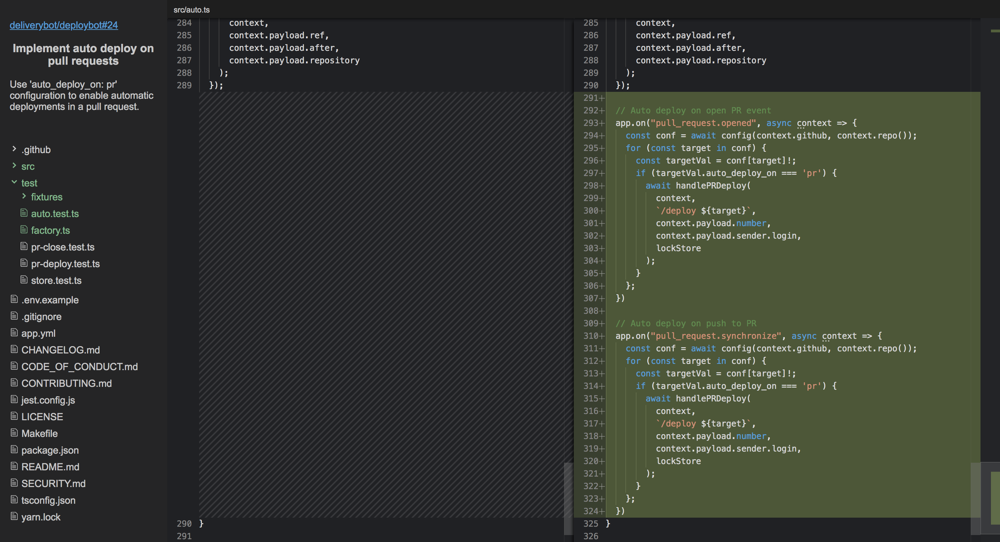

# PRHero

The GitHub UI for reviewing PR's isn't bad for simple changes but when PR's
get larger and more complex it's better to view them in your editor where you
can explore the changes in a file tree and view clear diffs.

What it does:

1. View PR's with a file tree explorer to see what's changed.
2. Rich diffs using VSCode's monaco editor.
3. Support for commenting (eventually).

PRHero is bringing the file tree and rich diff experience to your browser for
any pull request on GitHub. You don't have to clone the code to see it. It's
brought about by my current frustrations with the GitHub pull request review
experience and my desire to have a fully in browser workflow for reviewing
PR's.

### Try it out

Try the example https://colinjfw.github.io/prhero/#deliverybot/deploybot/24 or
review any pull request at https://colinjfw.github.io/prhero/#OWNER/REPO/PR.

### What's missing

- Private repositories.
- Smarter file tree expansion (will hit GitHub rate limits quickly).
- Commenting.
- PR approval.

### What do you think?

Let me know :)
